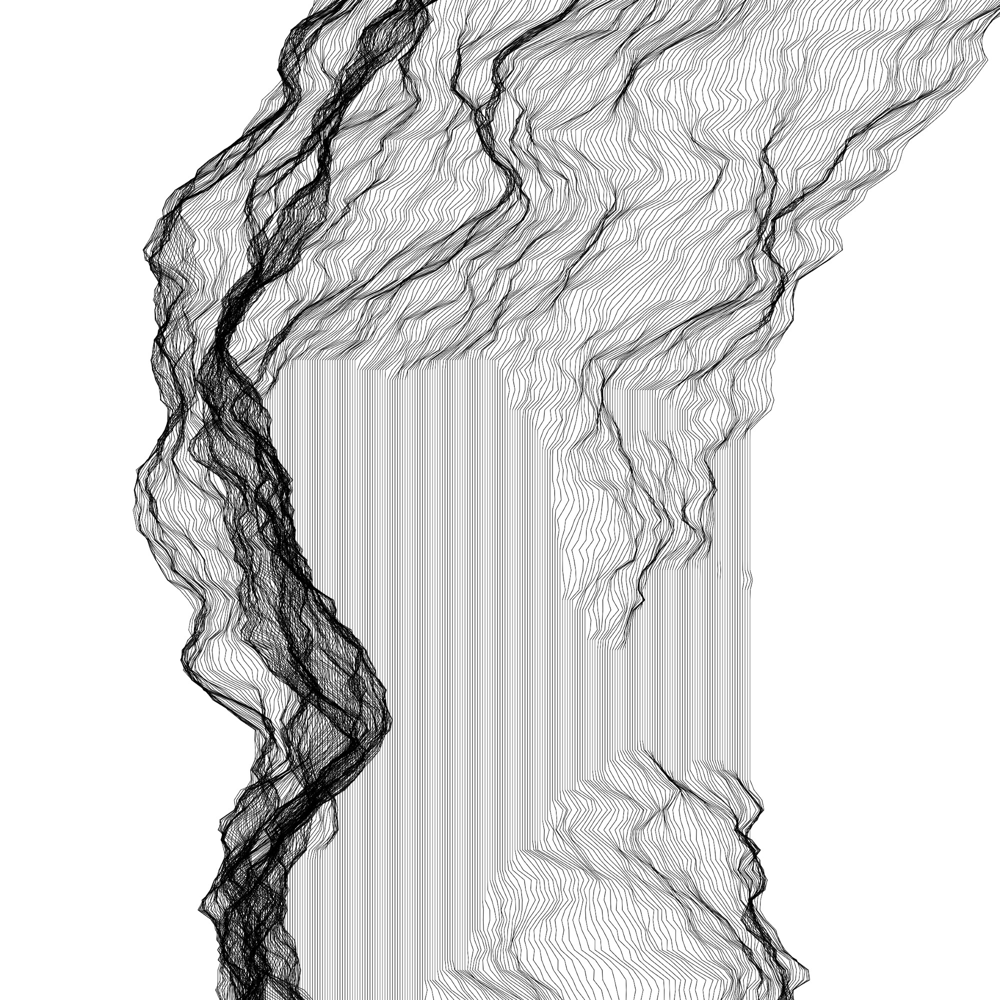

# Grafische Element & visuelle Effekte



Abgabe für den Kurs *Grafische Elemente & visuelle Effekte* im Wintersemester 19/20 bei *Prof. Klaus Keller* an der FH Potsdam.


## Building the book

This book is generated from source using the [Nix](https://nixos.org/nix) tool. If you have Nix installed, you can generate the book using the exerimental [flake](https://github.com/NixOS/rfcs/pull/49) feature. Both Nix and Nix flakes are somewhat esoteric tools in the software world, so the following explanation will explain their installation in depth.


### Installation

The easiest way to install this project is to build it as a Nix flake. Flakes are an experimental Nix feature, so first you'd need to [install the stable version of Nix](https://nixos.org/download.html):

```
curl -L https://nixos.org/nix/install | sh
```

With stable Nix installed, we can use Nix to aquire a temporary shell with unstable Nix. Note that this doesn't install Nix permanently, so you have to repeat this step every time you interact with flakes.

```
nix run nixpkgs.nixUnstable
```

In this temporary shell, we can finally build a Nix flake. No need to download anything prior or checkout a Git repository!

```
nix build github:erictapen/geve#pdf
```

If no errors happened, the final PDF file can be found in the current directory in `result/geve.pdf`. Note that `result` is just a symlink.


## Hacking

If you want to hack on the project, you might want to use the [Stack](https://docs.haskellstack.org/en/stable/README/) build tool. Executing `stack run` should be enough to generate the svg files in the `cache` dir.

If you are using Nix (with experimental flakes support enabled) and want to skip the `stack` part, you should be fine with pulling all necessary dependencies via `nix develop`, then run `runhaskell src/Main.hs`.


### The `cache` dir

After running, the `cache` directory is populated with images. Most of the images are generated only if they can't be found in the cache, so if you modify the source code you might need to delete the files in `cache` before rerunning the program.


### Code formatting

The code is formatted with [ormolu](https://github.com/tweag/ormolu). To format every Haskell source file in the repository, you can run `ormolu --mode inplace $(find src/ -name '*.hs')`.

